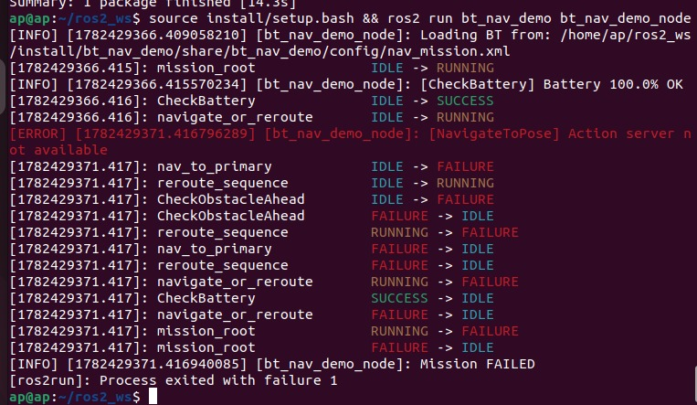

# bt_nav_demo + bt_nav_eval and Closed-Loop Navigation Evaluation Harness

A ROS 2 package that uses [BehaviorTree.CPP v4](https://www.behaviortree.dev/) to implement a mission-level autonomous task: navigate a robot to a target, check battery and obstacle state in real time, and automatically re-route around obstacles when the primary path fails.

This repo also includes **bt_nav_eval**, a closed-loop scenario evaluation harness built on top of the same Nav2 stack. It runs a TurtleBot3 through 10 procedurally-defined obstacle scenarios in Gazebo, collects per-scenario metrics (path efficiency, clearance, recovery count, velocity), and writes a structured JSON + Markdown report.

> **Skills demonstrated:** `BehaviorTree.CPP` · `ROS 2 Humble` · `Nav2` · `Gazebo` · `rclcpp_action` · `AMCL` · `DWB planner` · `LiDAR processing` · `C++17` · `async state machines` · `closed-loop evaluation`

---

## Demo

**bt_nav_eval: 10 scenario closed-loop eval (Gazebo + RViz side by side)**

Click the thumbnail to watch on YouTube:

[](https://www.youtube.com/watch?v=lsS41a8zwlo)

**bt_nav_demo: BehaviorTree.CPP mission execution output**

The terminal output below shows the BT ticking through CheckBattery, NavigateToPose, and the fallback reroute branch. No robot required to see the logic fire correctly.



---

## What bt_nav_demo does

```
[Battery OK?] --fail--> ABORT
      | ok
      v
[Navigate to primary goal (3.0, 1.5)]
      |
      +-- SUCCESS --> [Report mission complete]
      |
      +-- FAILURE --> [Obstacle ahead?]
                             | yes
                             v
                    [Set alternate goal (1.0, 3.0)]
                             |
                             v
                    [Navigate to alternate goal]
                             |
                             +-- SUCCESS --> [Report mission complete]
```

The entire mission logic lives in a single XML file (`config/nav_mission.xml`). Swap it at runtime with `bt_xml:=...` to change mission behaviour without recompiling.

---

## What bt_nav_eval does

bt_nav_eval is a standalone ROS 2 node that acts as a test harness for Nav2 agents. For each scenario it:

1. Spawns SDF box obstacles into Gazebo via the `/spawn_entity` service
2. Sends a `NavigateToPose` action goal and monitors feedback in real time
3. Collects odometry-integrated path length, LiDAR minimum clearance, cmd_vel statistics, and recovery count
4. Tears down obstacles and moves to the next scenario
5. Writes `metrics.json` and `evaluation_report.md` to a configurable output directory

**Scenarios run:**

| ID | Description | Result | Notes |
|---|---|---|---|
| s001 | Straight corridor, one obstacle | FAILURE | Goal accepted, robot moved 0.43 m with 16 recoveries before Nav2 aborted; hypothesis: costmap inflation around the spawned obstacle left no viable path to the goal at this scale |
| s002 | Narrow 0.6 m gap between walls | SUCCESS | DWB planner squeezed through after 8 recoveries; path_length 2.23 m, efficiency 0.67 |
| s003 | U-shaped dead end, forces recovery | SUCCESS | Goal accepted and succeeded in 0.1 s with 0 recoveries; robot was already near the goal position from the previous scenario |
| s004 | T-junction, goal around a corner | SUCCESS | 24 s, path_length 1.92 m, 0 recoveries; global planner found corner route cleanly |
| s005 | Five scattered obstacles | TIMEOUT | Robot made forward progress (0.97 m, 5 recoveries) but did not reach goal before timeout; hypothesis: obstacle spacing created a corridor too narrow for the DWB planner to commit to within the time limit |
| s006 | Diagonal run with mid-course obstacles | SUCCESS | 51 s, path_length 2.54 m; 4 recoveries navigating around two diagonal boxes |
| s007 | Goal 0.35 m from a wall | SUCCESS | 16.8 s, efficiency 1.00; local planner precision approach worked correctly |
| s008 | Diagonal obstacle field | TIMEOUT | path_length 1.25 m, 10 recoveries; robot made progress but did not reach goal; hypothesis: closely spaced diagonal obstacles caused repeated replanning cycles that exhausted the timeout |
| s009 | Goal completely enclosed (graceful failure test) | TIMEOUT | Expected near-failure: robot attempted approach (1.29 m, 2 recoveries) and was cancelled by the watchdog. Enclosure spacing may need to be tighter to trigger immediate planner rejection rather than timeout |
| s010 | Clear baseline, no obstacles | TIMEOUT | Robot moved only 0.16 m; hypothesis: AMCL localization drifted across 9 prior scenarios, causing phantom costmap inflation near the start pose. A re-localization step between scenarios would likely fix this |

**Observed pattern:** s005, s008, and s010 all show high recovery count with low forward progress. The hypothesis is DWB local planner oscillation under tight obstacle spacing or degraded localization. Potential fixes: reduce costmap inflation radius, increase controller frequency, or add a re-localization step between scenarios.

---

## BT Mission XML

The full mission tree lives in `config/nav_mission.xml`. Here is the core structure:

```xml
<root BTCPP_format="4">
  <BehaviorTree ID="NavMission">
    <Sequence name="mission_root">

      <CheckBattery battery_topic="/battery_state" min_percent="20.0" />

      <Fallback name="navigate_or_reroute">
        <NavigateToPose name="nav_to_primary"
          goal_x="3.0" goal_y="1.5" goal_yaw="0.0"
          nav_action_server="/navigate_to_pose" />

        <Sequence name="reroute_sequence">
          <CheckObstacleAhead scan_topic="/scan" obstacle_distance_m="0.5" />
          <SetAlternateGoal alternate_x="1.0" alternate_y="3.0" />
          <NavigateToPose name="nav_to_alternate"
            goal_x="{alternate_x}" goal_y="{alternate_y}" goal_yaw="0.0"
            nav_action_server="/navigate_to_pose" />
        </Sequence>
      </Fallback>

      <ReportSuccess message="Navigation mission complete." />
    </Sequence>
  </BehaviorTree>
</root>
```

---

## Package structure

```
bt_nav_demo/
├── config/
│   └── nav_mission.xml          # BT mission tree
├── include/bt_nav_demo/
│   ├── navigate_to_pose_action.hpp
│   ├── check_battery.hpp
│   ├── check_obstacle_ahead.hpp
│   ├── set_alternate_goal.hpp
│   └── report_success.hpp
├── src/
│   ├── main.cpp                 # Node entry point, factory, tick loop
│   └── nodes/
│       ├── navigate_to_pose_action.cpp   # Async Nav2 action wrapper
│       ├── check_battery.cpp             # /battery_state condition
│       ├── check_obstacle_ahead.cpp      # /scan forward-arc condition
│       ├── set_alternate_goal.cpp        # Blackboard goal writer
│       └── report_success.cpp            # Mission success logger
├── bt_nav_eval/                 # Closed-loop evaluation harness
│   ├── config/scenarios.yaml
│   ├── include/bt_nav_eval/
│   ├── src/
│   └── launch/
├── launch/
│   └── bt_nav_demo.launch.py
├── CMakeLists.txt
└── package.xml
```

---

## Custom BT nodes

| Node | Type | What it does |
|---|---|---|
| `CheckBattery` | Condition | Reads `/battery_state`, fails if below threshold |
| `NavigateToPose` | Async Action | Sends goal to Nav2, returns RUNNING/SUCCESS/FAILURE |
| `CheckObstacleAhead` | Condition | Reads `/scan`, succeeds if obstacle < 0.5 m ahead |
| `SetAlternateGoal` | Sync Action | Writes alternate x/y to BT blackboard |
| `ReportSuccess` | Sync Action | Logs mission complete message |

---

## Build

```bash
# Prerequisites: ROS 2 Humble, Nav2, BehaviorTree.CPP v4
sudo apt install ros-humble-behaviortree-cpp ros-humble-nav2-msgs \
  ros-humble-gazebo-msgs ros-humble-turtlebot3-gazebo \
  ros-humble-turtlebot3-navigation2

cd ~/ros2_ws
git clone https://github.com/asrithp244/bt_nav_demo src/bt_nav_demo
ln -s src/bt_nav_demo/bt_nav_eval src/bt_nav_eval
colcon build --cmake-args -DBUILD_TESTING=OFF
source install/setup.bash
```

---

## Run bt_nav_demo

```bash
# Terminal 1: start Nav2
ros2 launch turtlebot3_navigation2 navigation2.launch.py use_sim_time:=True

# Terminal 2: run the BT mission
ros2 launch bt_nav_demo bt_nav_demo.launch.py
```

Override the mission tree at runtime:

```bash
ros2 launch bt_nav_demo bt_nav_demo.launch.py \
    bt_xml:=/path/to/my_custom_mission.xml
```

---

## Run bt_nav_eval

```bash
# Terminal 1: Gazebo with TurtleBot3 world
export TURTLEBOT3_MODEL=burger
ros2 launch turtlebot3_gazebo turtlebot3_world.launch.py

# Terminal 2: Nav2 navigation stack
export TURTLEBOT3_MODEL=burger
ros2 launch turtlebot3_navigation2 navigation2.launch.py use_sim_time:=True

# Set 2D Pose Estimate in RViz, wait for Navigation: active, then:

# Terminal 3: run the evaluation harness
source ~/ros2_ws/install/setup.bash
ros2 launch bt_nav_eval bt_nav_eval.launch.py output_dir:=$HOME/eval_results
```

Results are written to `~/eval_results/metrics.json` and `~/eval_results/evaluation_report.md`.

---

## Tests

```bash
colcon test --packages-select bt_nav_eval
colcon test-result --verbose
```
